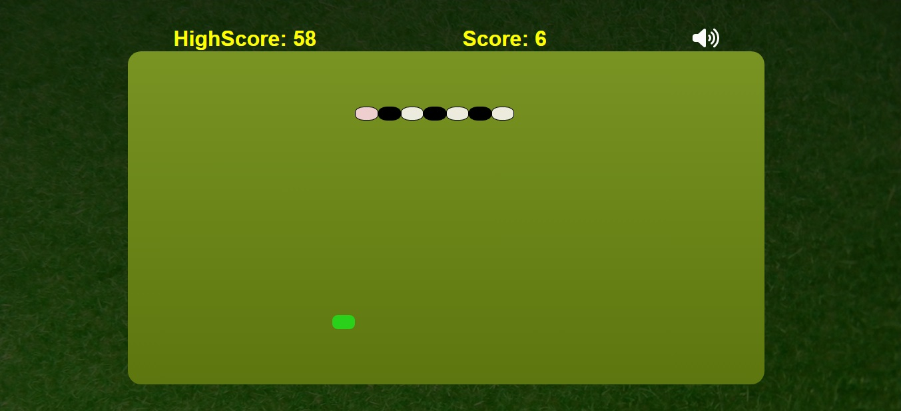
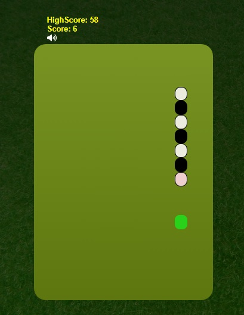

# Snake Game

## Description :
The Snake game is a classic arcade game where the player controls a snake that moves around the screen, eating food and growing longer. The objective of the game is to eat as much food as possible without colliding with the snake's own body or the walls of the game area.

To create the Snake game, I have used HTML, CSS, and JavaScript.

The HTML structure will consist of a 
 element that represents the game area. Inside the game area, there will be a 
 element for each segment of the snake, as well as a 
 element for the food.

CSS is used to style the game area, the snake, and the food. 

Following CSS properties are used :
 -   ####   width
 -   ####  height
 -   ####  background-color
 -   ####  border
 -   ####  grid Layout 
 -   ####  flex Box
 -   ####  background-image

In JavaScript, I have handled the game logic. I have used an event listeners to detect keyboard input from the player and move the snake accordingly. I  also writen a  functions to handle the snake's movement, food generation, collision detection, and score tracking.

When the game starts, the snake will begin moving in a specific direction. The player can change the direction using the arrow keys. As the snake moves, it will update its position and check for collisions with the food or the walls. If the snake collides with the food, it will grow longer, and the player's score will increase. If the snake collides with its own body or the walls, the game will end.

To create a more engaging experience, I have  added sound effects when the snake eats the food or collides with something. and provided a restart option when the game ends.

To implement a game loop using requestAnimationFrame() to update the game state and redraw the screen at regular intervals.

## Screenshots

## How To play

#### This game can be played by using only arrow keys

- ArrowUp   ↑ :  is used to move the snake in upword direction

- ArrowDown   ↓ :  is used to move the snake in downword direction

- ArrowLeft   ← :  is used to move the snake to left direction

- ArrowRight   → :  is used to move the snake to right direction

# Technologies Used

- HTML
- CSS
- Javascript
